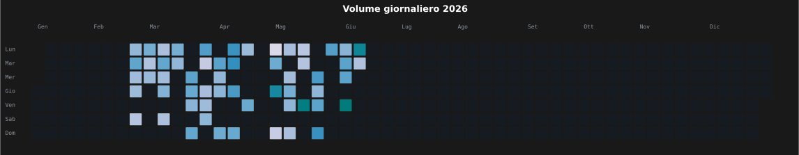
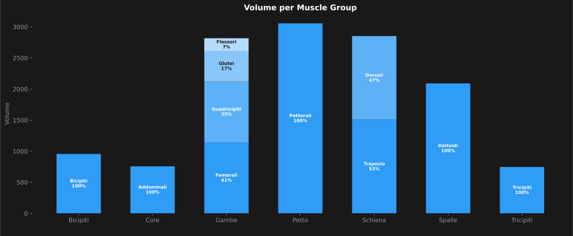

# 🏋️ Fitness Tracker

Personal fitness tracking dashboard — daily volume, muscle group breakdown, and training trends pulled from Notion via API and auto-updated daily.

---

## 📊 Charts

### Volume Giornaliero 2026


### Volume per Muscle Group


---

## 🚀 Setup

1. Clone the repo
2. Install dependencies:
   ```bash
   pip install pandas matplotlib notion-client

